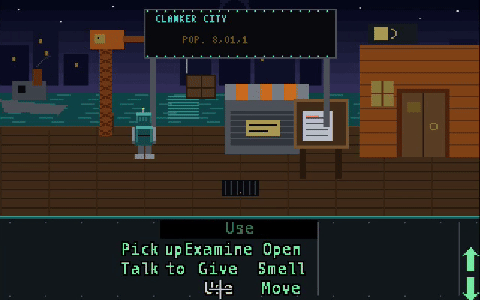

# Clanker City Chronicles 🤖🏝️

A point-and-click adventure game set in **Clanker City**, the robot metropolis
on Clankey Island — built to run in [ScummVM](https://www.scummvm.org/).

**▶ Play it in your browser: <https://groblegark.github.io/clankeyisland/>**



*(recorded automatically by the [walk-through-er](docs/WALKTHROUGHER.md),
which also gates deploys: if it can't finish the game, we don't ship)*

> *Deep in the Rust Belt Sea lies Clankey Island, home to Clanker City: a
> sprawling metropolis of robots, where steam hisses from manhole covers,
> neon gears spin above every storefront, and somewhere downtown the Great
> Dynamo is starting to wind down...*

## How this works

ScummVM doesn't author games — it *runs* them. We author everything as plain
text and compile to a **real SCUMM v6 game** (the Day of the Tentacle engine)
using [ScummC](https://github.com/AlbanBedel/scummc). No editor, no GUI:
rooms, dialog, and logic are C-like `.scc` scripts; costumes are `.scost`
text files pointing at image frames. See `tools/BUILD.md` for the pipeline,
and `tools/setup-scummc.sh` to bootstrap the toolchain.

1. Author scenes, scripts, and assets here (this repo is the source of truth).
2. `make` → `scc` compiles, `sld` links → `tentacle.000/.001`.
3. `scummvm -p game/build scumm:tentacle` → play.

```
assets/      Art, music, sound — source files (PNG, etc.)
  backgrounds/   Room background paintings (320x200 or 640x400)
  sprites/       Characters, objects, cursors
  portraits/     Dialog portraits
  music/         Tunes (the Clanker City Shuffle goes here)
  sfx/           Clanks, hisses, servo whirs
  fonts/
game/
  scenes/        One design doc per room/scene
  scripts/       Game logic / dialog scripts
docs/
  GDD.md         Game design document — story, characters, puzzles
tools/           Build & conversion helpers
```

## Running ScummVM

```bash
brew install scummvm   # already handled
cd game && make run    # build + play locally
```

## Web version

`tools/build-web.sh` compiles ScummVM itself to WebAssembly (via its
official emscripten port, SCUMM engine only, ~10MB wasm), drops the game
files into the lazy HTTP filesystem, seeds a `scummvm.ini` so the game is
pre-registered, and emits an `index.html` that auto-launches it via the
URL fragment. The result in `web/dist/` is a fully static site — no
special headers needed (the port is single-threaded Asyncify) — deployed
to GitHub Pages on the `gh-pages` branch.

Note: the data path is baked into the wasm as an origin-absolute URL
(`/clankeyisland/data`), so the site must stay mounted at that path; set
`SITE_PATH` when building for a different mount point. ScummVM is GPL —
sources: [scummvm/scummvm](https://github.com/scummvm/scummvm) plus the
one-line `tools/patches/0002-scummvm-configure-respect-datadir.patch`.

## Status

- [x] Repo + project skeleton
- [x] Game design doc (docs/GDD.md)
- [x] First scene designs (game/scenes/)
- [x] ScummC toolchain building on macOS/arm64 (tools/setup-scummc.sh)
- [x] Demo game (openquest) compiled + detected by ScummVM 2026.2.0
- [x] First playable room: the Docks (game/docks.scc, all art generated by tools/genassets.py)
- [x] Browser version, publicly hosted (tools/build-web.sh → GitHub Pages)
- [ ] Scene 02: the Scrap & Barrel tavern
- [x] Scene 01 audio: 'Dockside' theme (tools/genmusic.py) + synthesized SFX (tools/genaudio.py), playing native and in-browser
